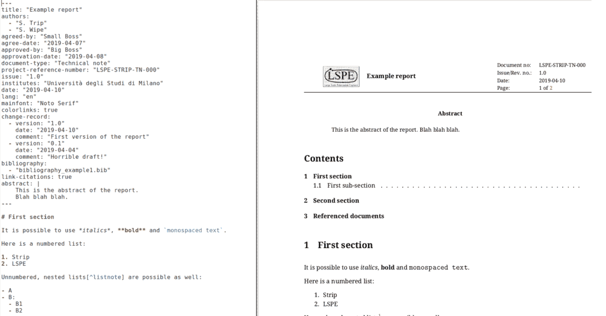

# Pandoc template for LSPE/Strip reports

This folder provides a [Pandoc](https://pandoc.org/) template to
create beautiful LSPE/Strip reports from Markdown files.



The following features are currently supported:

- [X] Production of a compliant title page
- [X] Multiple authors
- [X] Support for BibTeX bibliographies
- [X] Change list
- [X] Table of contents
- [X] Abstract
- [X] Support for Unicode characters


## Why on Earth would this be useful?

It allows you to *quickly* produce a nicely-formatted technical
document using LaTeX but avoiding its strange syntax. Markdown text
can be easily written and read (see [Pandoc User's
Guide](https://pandoc.org/MANUAL.html#pandocs-markdown) for a complete
reference of Markdown syntax):

```
# Introduction

- This is *very* important to remember!
- Here is a code snippet: `a+b`
- Here is an hyperlink: https://www.google.com

## A short subsection

And here is a table:

| Column 1 | Column 2 |
|----------|----------|
| Foo      | 10.1     |
| Bar      | 10.2     |

Table: This is the caption of the table.
```

Instead, if you use LaTeX you should write:

```tex
\section{Introduction}

\begin{itemize}
\item This is \emph{very} important to remember!
\item Here is a code snippet: \verb|a+b|.
\item Here is an hyperlink: \url{https://www.google.com}
\end{itemize}

\subsection{A short subsection}

And here is a table:
\begin{table}
  \centering
  \caption{This is the caption of the table}
  \begin{tabular}{ll}
    \hline
    \textbf{Column 1}& \textbf{Column 2}\\
    \hline
    Foo& 10.1\\
    Bar& 10.2\\
    \hline
  \end{tabular}
\end{table}
```

## Requisites

You need Pandoc, of course, as well as a number of LaTeX packages. The
template uses LuaLaTeX, in order to properly support Unicode
characters. The document is based on the standard `article` class.


## How to use it

Copy `example.md`, `lspe_template.tex`, and `lspe_logo.pdf` in some
folder, and change `example.md` as you wish. Compile it with the
following options:

    pandoc --template=lspe_template.tex \
        --filter=pandoc-citeproc \
        -f markdown+tex_math_double_backslash \
        -t latex \
        --pdf-engine=lualatex \
        -o example.pdf example.md
    
Here is an explanation of the flags used:

- `--template=lspe_template.tex`: this is fundamental, as it specifies
  the template to use in the generation of the document.
- `--filter=pandoc-citeproc`: this must be used if you want a
  bibliography (see below) to appear in the document.
- `-f markdown+tex_math_double_backslash`: this flag specifies the
  dialect used in the input file. The dialect should always begin with
  `markdown` or `gfm` (GitHub-flavoured Markdown); other fields
  specify plugins that enable additional features (see the [Pandoc
  User's Guide](https://pandoc.org/MANUAL.html)). There are no
  specific requirements on the plugins; the provided `Makefile` uses
  these:
  - `tex_math_double_backslash` enables writing LaTeX equations within
    `\\(` and `\\)`.
- `-t latex`: this is required, as the Pandoc template is written in
  LaTeX;
- `--pdf-engine=lualatex`: you could probably use `xelatex` as well,
  but `lualatex` plays nicely with Unicode characters. (`pdflatex` is
  not supported.)
- `-o example.pdf`: name of the output file. If you pass a name ending
  with `.tex`, the intermediate LaTeX file will be written instead; in
  this case, there is no need to use the `--pdf-engine` flag.


## Document metadata

A number of information used to build the document must be included in
the so-called *header*: a block of text enclosed within three slashes:
`---`. The text should follow the YAML format, and will look more or
less like this (taken from `example.md`):

```yaml
---
title: "Example report"
authors:
  - "S. Trip"
  - "S. Wipe"
agreed-by: "Small Boss"
agree-date: "2019-04-07"
approved-by: "Big Boss"
approvation-date: "2019-04-08"
document-type: "Technical note"
project-reference-number: "LSPE-STRIP-TN-000"
issue: "1.0"
institutes: "Università degli Studi di Milano"
date: "2019-04-10"
lang: "en"
mainfont: "Noto Serif"
colorlinks: true
change-record:
  - version: "1.0"
    date: "2019-04-10"
    comment: "First version of the report"
  - version: "0.1"
    date: "2019-04-04"
    comment: "Horrible draft!"
bibliography:
  - "bibliography_example1.bib"
link-citations: true
abstract: |
    This is the abstract of the report.
    Blah blah blah.
---
```

Here is a table explaining the meaning of each entry.

| Field                      | Type            | Meaning                                                      |
|:---------------------------|:----------------|:-------------------------------------------------------------|
| `abstract`                 | String          | Abstract for the document                                    |
| `agree-date`               | String          | Date when the document was agreed to be released             |
| `agreed-by`                | String          | Name of the person that agreed to release the document       |
| `approvation-date`         | String          | Date when the document was approved                          |
| `approved-by`              | String          | Name of the person that approved the release of the document |
| `authors`                  | List of strings | List of the authors                                          |
| `bibliography`             | List of strings | List of `.bib` file names containing the bibliography        |
| `change-record`            | List of fields  | Each field must contain `version`, `date`, and `comment`     |
| `colorlinks`               | Boolean         | If `true`, links in the text will be colored                 |
| `date`                     | String          | Date when the document was issued                            |
| `document-type`            | String          | Type of the document, e.g., "Specification document"         |
| `institutes`               | String          | Affiliation of the author(s)                                 |
| `issue`                    | String          | Version number                                               |
| `lang`                     | String          | Language of the document                                     |
| `lof`                      | Boolean         | If `true`, include a list of figures                         |
| `lot`                      | Boolean         | If `true`, include a list of tables                          |
| `link-citations`           | Boolean         | If `true`, hyperlinks will be created for each citation      |
| `mainfont`                 | String          | Font to be used in the document body                         |
| `project-reference-number` | String          | Unique identifier for the document                           |
| `title`                    | String          | Title of the document                                        |
